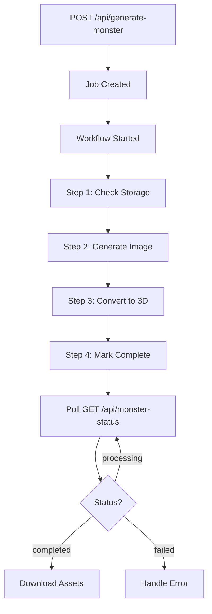
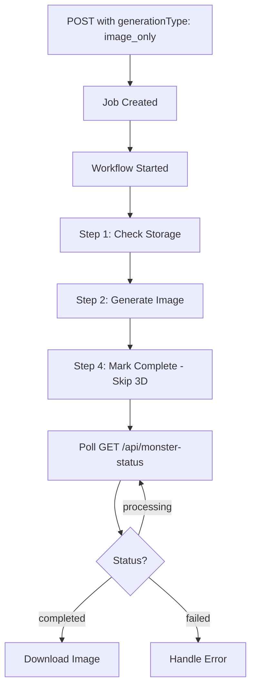

# 🎨 Asset Pipeline API Documentation

**Version:** 2.0 (Workflow-Powered)
**Last Updated:** 2025-11-05
**Status:** Production Ready

---

## 📋 Table of Contents

1. [Overview](#overview)
2. [Authentication](#authentication)
3. [Endpoints](#endpoints)
4. [Request Flow](#request-flow)
5. [Data Types](#data-types)
6. [Status & Progress Tracking](#status--progress-tracking)
7. [Error Handling](#error-handling)
8. [Integration Examples](#integration-examples)
9. [Cost Information](#cost-information)
10. [Rate Limits](#rate-limits)

---

## Overview

The Asset Pipeline API generates AI-powered monster images and 3D models using:
- **OpenAI DALL-E 3** for high-quality 2D images (1024x1024 PNG with transparent backgrounds)
- **fal.ai Tripo3D v2.5** for image-to-3D conversion (GLB models)
- **Vercel Workflow** for durable execution (survives timeouts, automatic retries)

### Key Features

✅ **Durable Execution** - Workflows survive Vercel serverless timeouts
✅ **Automatic Retries** - Built-in exponential backoff for transient failures
✅ **Real-time Status** - Poll job status for progress updates
✅ **Presigned URLs** - S3/MinIO storage with auto-refreshing signed URLs
✅ **Type-Safe** - Full TypeScript support with comprehensive types
✅ **Cost Tracking** - Per-job cost tracking for OpenAI and fal.ai

### Architecture

```
POST /api/generate-monster
  ↓
Job Created → Workflow Started
  ↓
Step 1: Check S3 Storage
  ↓
Step 2: Generate Image (OpenAI DALL-E 3)
  ↓
Step 3: Convert to 3D (fal.ai Tripo3D) [optional]
  ↓
Step 4: Mark Complete
  ↓
GET /api/monster-status/[jobId] → Poll for results
```

---

## Authentication

All endpoints require GitHub OAuth authentication via Better Auth.

### Session Token

Include the `better-auth.session_token` cookie in all requests:

```bash
curl -X POST https://your-domain.com/api/generate-monster \
  -H "Cookie: better-auth.session_token=YOUR_SESSION_TOKEN" \
  -H "Content-Type: application/json" \
  -d '{ ... }'
```

### Authorization

- **POST /api/generate-monster**: Requires admin access
- **GET /api/monster-status/[jobId]**: Requires ownership of job (user ID must match)

**Note:** In production, monster generation happens through the lesson flow. The direct API is primarily for testing and admin use.

---

## Endpoints

### 1. Create Generation Job

**Endpoint:** `POST /api/generate-monster`

**Description:** Creates a new monster generation job and starts the workflow.

#### Request Body

```typescript
interface GenerateMonsterRequest {
  // Physical Attributes
  eyes: 1 | 2 | 3 | 4;
  bodyType: 'chubby' | 'tall' | 'fluffy' | 'reptilian' | 'aquatic' | 'crystalline' | 'plant' | 'robotic';
  size: 'tiny' | 'small' | 'medium' | 'large' | 'giant';

  // Personality & Behavior
  attitude: 'sassy' | 'crypto-degen' | 'rainbow' | 'wise' | 'mischievous' | 'regal' | 'robotic' | 'kawaii';

  // Magical Abilities
  canFly: 'wings' | 'floating' | 'no';
  specialPower: 'fire' | 'ice' | 'lightning' | 'nature' | 'psychic' | 'star' | 'crystal' | 'wind';
  magicalAura: 'sparkly' | 'fiery' | 'cosmic' | 'watery' | 'floral';

  // Appearance
  colorScheme: 'red' | 'blue' | 'green' | 'purple' | 'rainbow' | 'dark' | 'light' | 'metallic';
  texture: 'scales' | 'fur' | 'metal' | 'crystal' | 'plant' | 'ethereal';

  // Environment
  habitat: 'mountains' | 'ocean' | 'forest' | 'space' | 'desert' | 'ruins' | 'city' | 'clouds';

  // Legacy fields (backward compatibility)
  style?: 'cute' | 'fierce' | 'mysterious' | 'playful' | 'cosmic'; // Defaults to 'cute'
  stage: 'egg' | 'young' | 'adult';
  generationType?: 'full' | 'image_only'; // Defaults to 'full'
}
```

#### Response

```typescript
interface GenerateMonsterResponse {
  success: boolean;
  jobId?: string;        // UUID of the generation job
  runId?: string;        // Vercel Workflow run ID (for monitoring)
  resumed?: boolean;     // True if resuming existing job (duplicate prevention)
  error?: string;        // Error message if success = false
}
```

#### Example Request

```json
{
  "eyes": 2,
  "bodyType": "fluffy",
  "size": "medium",
  "attitude": "cute",
  "canFly": "no",
  "specialPower": "nature",
  "magicalAura": "sparkly",
  "colorScheme": "purple",
  "texture": "fur",
  "habitat": "forest",
  "stage": "young",
  "generationType": "full"
}
```

#### Example Response (Success)

```json
{
  "success": true,
  "jobId": "a1b2c3d4-e5f6-4789-a0b1-c2d3e4f5g6h7",
  "runId": "wf_abc123xyz789"
}
```

#### Example Response (Resumed)

```json
{
  "success": true,
  "jobId": "a1b2c3d4-e5f6-4789-a0b1-c2d3e4f5g6h7",
  "runId": "wf_abc123xyz789",
  "resumed": true
}
```

#### HTTP Status Codes

- `201 Created` - Job created successfully
- `200 OK` - Resumed existing job (duplicate prevention)
- `400 Bad Request` - Validation errors in request body
- `401 Unauthorized` - Authentication required
- `403 Forbidden` - Admin access required
- `429 Too Many Requests` - Rate limit exceeded (max active jobs per user)

---

### 2. Get Job Status

**Endpoint:** `GET /api/monster-status/[jobId]`

**Description:** Get the current status and progress of a generation job.

#### Path Parameters

- `jobId` (string, UUID format) - The job ID returned from POST /api/generate-monster

#### Response

```typescript
interface MonsterStatusResponse {
  success: boolean;
  job?: GenerationJobData;
  processing?: boolean;    // True if workflow is currently running
  retryInSeconds?: number; // Suggested retry delay for polling
  error?: string;
}

interface GenerationJobData {
  id: string;
  userId: string;
  workflowRunId?: string;
  prompt: string;                    // Server-generated AI prompt
  style: MonsterStyle;
  stage: MonsterStage;
  generationType: GenerationType;
  status: GenerationStatus;
  progress: number;                  // 0-100
  errorMessage?: string;             // Technical error message
  userMessage?: string;              // User-friendly message
  imageS3Key?: string;               // S3 object key for image
  imageUrl?: string;                 // Presigned URL (expires in 2 hours)
  glbS3Key?: string;                 // S3 object key for 3D model
  glbUrl?: string;                   // Presigned URL (expires in 2 hours)
  totalCost: number;                 // Total cost in USD
  retryCount: number;
  createdAt: Date;
  updatedAt: Date;
  completedAt?: Date;

  // Cost tracking
  openaiTextTokens: number;
  openaiImageTokens: number;
  openaiTotalTokens: number;
  openaiEstimatedCost: number;
  falEstimatedCost: number;
  costCalculationMethod: string;
  lastCostUpdate: Date;
}
```

#### Example Response (In Progress)

```json
{
  "success": true,
  "processing": true,
  "job": {
    "id": "a1b2c3d4-e5f6-4789-a0b1-c2d3e4f5g6h7",
    "userId": "user_123",
    "workflowRunId": "wf_abc123xyz789",
    "status": "generating_image",
    "progress": 25,
    "userMessage": "🎨 Generating your monster image...",
    "totalCost": 0,
    "retryCount": 0,
    "createdAt": "2025-11-05T10:00:00.000Z",
    "updatedAt": "2025-11-05T10:00:15.000Z"
  }
}
```

#### Example Response (Completed)

```json
{
  "success": true,
  "processing": false,
  "job": {
    "id": "a1b2c3d4-e5f6-4789-a0b1-c2d3e4f5g6h7",
    "userId": "user_123",
    "workflowRunId": "wf_abc123xyz789",
    "status": "completed",
    "progress": 100,
    "userMessage": "🎉 Your monster is ready!",
    "imageS3Key": "monsters/a1b2c3d4-e5f6-4789-a0b1-c2d3e4f5g6h7.png",
    "imageUrl": "https://s3.amazonaws.com/bucket/monsters/...?signature=...",
    "glbS3Key": "monsters/a1b2c3d4-e5f6-4789-a0b1-c2d3e4f5g6h7.glb",
    "glbUrl": "https://s3.amazonaws.com/bucket/monsters/...?signature=...",
    "totalCost": 0.34,
    "openaiEstimatedCost": 0.04,
    "falEstimatedCost": 0.30,
    "retryCount": 0,
    "createdAt": "2025-11-05T10:00:00.000Z",
    "updatedAt": "2025-11-05T10:01:30.000Z",
    "completedAt": "2025-11-05T10:01:30.000Z"
  }
}
```

#### HTTP Status Codes

- `200 OK` - Job status retrieved successfully
- `400 Bad Request` - Invalid job ID format (not UUID)
- `401 Unauthorized` - Authentication required
- `403 Forbidden` - Job belongs to another user
- `404 Not Found` - Job ID not found

---

## Request Flow

### Complete Generation Flow (Full Pipeline)



### Image-Only Generation Flow



---

## Data Types

### GenerationStatus

The job progresses through these states:

```typescript
type GenerationStatus =
  | 'pending'                      // Workflow starting up
  | 'generating_image'             // OpenAI image generation in progress
  | 'image_generation_failed'      // Image generation failed permanently
  | 'image_generation_retrying'    // Image generation auto-retrying
  | 'converting_3d'                // fal.ai 3D conversion in progress
  | 'conversion_failed'            // 3D conversion failed permanently
  | 'conversion_retrying'          // 3D conversion auto-retrying
  | 'completed'                    // All steps completed successfully
  | 'failed_permanent'             // Fatal error, no more retries
  | 'waiting_on_storage';          // S3/MinIO unavailable
```

### Progress Percentage

Progress is reported as 0-100:

| Status | Progress Range | Description |
|--------|---------------|-------------|
| `pending` | 0% | Workflow initializing |
| `generating_image` | 10-40% | Image being generated |
| `converting_3d` | 50-90% | 3D model being created |
| `completed` | 100% | All assets ready |

### Monster Attributes Reference

#### Eyes
- `1` - One eye (cyclops style)
- `2` - Two eyes (standard)
- `3` - Three eyes (mystical)
- `4` - Many eyes (alien-like)

#### Body Types
- `chubby` - Round, soft body
- `tall` - Elongated, slender
- `fluffy` - Furry, cloud-like
- `reptilian` - Scaled, lizard-like
- `aquatic` - Water creature features
- `crystalline` - Gem-like, angular
- `plant` - Flora-inspired
- `robotic` - Mechanical parts

#### Size
- `tiny` - Very small creature
- `small` - Small creature
- `medium` - Average size
- `large` - Big creature
- `giant` - Massive creature

#### Attitude
- `sassy` - Confident and cheeky
- `crypto-degen` - Tech-savvy trader vibes
- `rainbow` - Joyful and colorful
- `wise` - Ancient and knowing
- `mischievous` - Playful trickster
- `regal` - Noble and dignified
- `robotic` - Logical and mechanical
- `kawaii` - Extremely cute

#### Flight Abilities
- `wings` - Has visible wings
- `floating` - Levitates magically
- `no` - Grounded creature

#### Special Powers
- `fire` - Fire-based abilities
- `ice` - Ice/frost powers
- `lightning` - Electric powers
- `nature` - Plant/earth magic
- `psychic` - Mental abilities
- `star` - Cosmic/celestial
- `crystal` - Gem-based magic
- `wind` - Air/storm powers

#### Magical Aura
- `sparkly` - Shimmering particles
- `fiery` - Flame aura
- `cosmic` - Space/stars effect
- `watery` - Liquid/mist effect
- `floral` - Flower/nature glow

#### Color Schemes
- `red`, `blue`, `green`, `purple` - Single color palettes
- `rainbow` - Multi-color gradient
- `dark` - Dark tones
- `light` - Bright pastels
- `metallic` - Shiny, reflective

#### Textures
- `scales` - Reptilian scales
- `fur` - Soft, fuzzy
- `metal` - Metallic surface
- `crystal` - Gem-like facets
- `plant` - Leaf/vine texture
- `ethereal` - Translucent, ghostly

#### Habitats
- `mountains` - Rocky, alpine
- `ocean` - Aquatic environment
- `forest` - Woodland setting
- `space` - Cosmic void
- `desert` - Sandy, arid
- `ruins` - Ancient structures
- `city` - Urban landscape
- `clouds` - Sky dwelling

#### Life Stages
- `egg` - Unhatched egg form (shell visible)
- `young` - Baby/juvenile creature
- `adult` - Fully grown, mature

#### Generation Types
- `full` - Generate both image and 3D model (~90 seconds, $0.34)
- `image_only` - Generate only 2D image (~30 seconds, $0.04)

---

## Status & Progress Tracking

### Polling Strategy

**Recommended polling intervals:**

```typescript
const POLLING_INTERVALS = {
  initial: 2000,       // 2 seconds - first few polls
  standard: 5000,      // 5 seconds - normal progress
  retrying: 10000,     // 10 seconds - when status is *_retrying
  failed: null,        // Stop polling on permanent failure
  completed: null      // Stop polling on completion
};
```

### Example Polling Implementation

```typescript
async function pollJobStatus(jobId: string): Promise<GenerationJobData> {
  let attempts = 0;
  const maxAttempts = 60; // 5 minutes max with 5s intervals

  while (attempts < maxAttempts) {
    const response = await fetch(`/api/monster-status/${jobId}`, {
      credentials: 'include' // Include session cookie
    });

    const data: MonsterStatusResponse = await response.json();

    if (!data.success) {
      throw new Error(data.error || 'Failed to get job status');
    }

    const job = data.job!;

    // Terminal states - stop polling
    if (job.status === 'completed') {
      return job; // Success!
    }

    if (job.status === 'image_generation_failed' ||
        job.status === 'conversion_failed' ||
        job.status === 'failed_permanent') {
      throw new Error(job.userMessage || job.errorMessage || 'Generation failed');
    }

    // Still processing - wait and poll again
    const isRetrying = job.status.includes('retrying');
    const delay = isRetrying ? 10000 : 5000;

    await new Promise(resolve => setTimeout(resolve, delay));
    attempts++;
  }

  throw new Error('Job polling timeout - maximum attempts reached');
}
```

### Status Messages

The API provides user-friendly messages in `job.userMessage`:

| Status | Example User Message |
|--------|---------------------|
| `pending` | "🥚 Preparing your monster..." |
| `generating_image` | "🎨 Generating your monster image..." |
| `image_generation_retrying` | "Image generation issue. Auto-retry 2..." |
| `converting_3d` | "🎯 Converting your image to 3D model..." |
| `conversion_retrying` | "3D conversion taking longer than usual. Auto-retry 1..." |
| `completed` | "🎉 Your monster is ready!" |
| `image_generation_failed` | "Image generation failed permanently" |
| `conversion_failed` | "3D conversion failed permanently" |

---

## Error Handling

### Error Types

The pipeline handles 16 distinct error types with automatic retry logic:

#### OpenAI Errors

| Error Code | Retryable | Retry Delay | Max Retries | User Message |
|------------|-----------|-------------|-------------|--------------|
| `openai_rate_limit` | ✅ Yes | 30s | 5 | "High demand. Auto-retry in 30 seconds." |
| `openai_network_timeout` | ✅ Yes | 15s | 3 | "Connection hiccup! Retrying now..." |
| `openai_api_error` | ✅ Yes | 120s | 2 | "Temporary issue. Try again in a few minutes." |
| `openai_invalid_api_key` | ❌ No | - | 0 | "Cannot authenticate with OpenAI." |
| `openai_insufficient_quota` | ❌ No | - | 0 | "OpenAI credits exhausted." |
| `openai_content_policy` | ❌ No | - | 0 | "Description needs to be more family-friendly." |

#### fal.ai Errors

| Error Code | Retryable | Retry Delay | Max Retries | User Message |
|------------|-----------|-------------|-------------|--------------|
| `fal_overloaded` | ✅ Yes | 120s | 10 | "High demand. Auto-retry in 2 minutes." |
| `fal_network_timeout` | ✅ Yes | 60s | 5 | "Taking longer than usual. Still working on it!" |
| `fal_api_error` | ✅ Yes | 600s | 3 | "Service provider down. Check back in 10-15 minutes." |
| `fal_invalid_api_key` | ❌ No | - | 0 | "Cannot authenticate with 3D service." |
| `fal_insufficient_quota` | ❌ No | - | 0 | "fal.ai credits exhausted." |

#### Infrastructure Errors

| Error Code | Retryable | Retry Delay | Max Retries | User Message |
|------------|-----------|-------------|-------------|--------------|
| `s3_upload_error` | ✅ Yes | 10s | 5 | "Storage upload issue. Retrying..." |
| `s3_storage_unavailable` | ❌ No | - | 0 | "Storage unreachable. Verify S3/MinIO service." |
| `database_error` | ✅ Yes | 5s | 3 | "Trouble saving progress. Retrying now..." |
| `unknown` | ✅ Yes | 60s | 2 | "Unexpected error. Try again in a few minutes." |

### Error Response Format

When an error occurs, the job status will reflect it:

```json
{
  "success": true,
  "processing": false,
  "job": {
    "id": "...",
    "status": "image_generation_failed",
    "progress": 25,
    "errorMessage": "Rate limit exceeded on OpenAI API",
    "userMessage": "Our image generator is experiencing high demand. We'll automatically retry in 30 seconds.",
    "retryCount": 3
  }
}
```

### Handling Permanent Failures

```typescript
function handleJobStatus(job: GenerationJobData) {
  const permanentFailures = [
    'image_generation_failed',
    'conversion_failed',
    'failed_permanent'
  ];

  if (permanentFailures.includes(job.status)) {
    // Show error to user, allow manual retry
    alert(job.userMessage || 'Generation failed');

    // Log technical details for debugging
    console.error('Job failed:', {
      jobId: job.id,
      status: job.status,
      errorMessage: job.errorMessage,
      retryCount: job.retryCount
    });

    return;
  }

  // Still processing...
}
```

---

## Integration Examples

### React Integration (Full Pipeline)

```typescript
import { useState, useEffect } from 'react';

interface MonsterAssets {
  imageUrl: string;
  glbUrl: string;
  cost: number;
}

export function useMonsterGeneration() {
  const [loading, setLoading] = useState(false);
  const [progress, setProgress] = useState(0);
  const [status, setStatus] = useState<string>('idle');
  const [assets, setAssets] = useState<MonsterAssets | null>(null);
  const [error, setError] = useState<string | null>(null);

  const generateMonster = async (params: GenerateMonsterRequest) => {
    setLoading(true);
    setProgress(0);
    setError(null);

    try {
      // Step 1: Create job
      const createResponse = await fetch('/api/generate-monster', {
        method: 'POST',
        headers: { 'Content-Type': 'application/json' },
        credentials: 'include',
        body: JSON.stringify(params)
      });

      const createData: GenerateMonsterResponse = await createResponse.json();

      if (!createData.success) {
        throw new Error(createData.error || 'Failed to create job');
      }

      const jobId = createData.jobId!;

      // Step 2: Poll for completion
      const pollInterval = setInterval(async () => {
        const statusResponse = await fetch(`/api/monster-status/${jobId}`, {
          credentials: 'include'
        });

        const statusData: MonsterStatusResponse = await statusResponse.json();

        if (!statusData.success) {
          clearInterval(pollInterval);
          setError(statusData.error || 'Failed to get status');
          setLoading(false);
          return;
        }

        const job = statusData.job!;
        setProgress(job.progress);
        setStatus(job.status);

        // Terminal states
        if (job.status === 'completed') {
          clearInterval(pollInterval);
          setAssets({
            imageUrl: job.imageUrl!,
            glbUrl: job.glbUrl!,
            cost: job.totalCost
          });
          setLoading(false);
        } else if (
          job.status === 'image_generation_failed' ||
          job.status === 'conversion_failed' ||
          job.status === 'failed_permanent'
        ) {
          clearInterval(pollInterval);
          setError(job.userMessage || job.errorMessage || 'Generation failed');
          setLoading(false);
        }
      }, 5000); // Poll every 5 seconds

    } catch (err) {
      setError(err instanceof Error ? err.message : 'Unknown error');
      setLoading(false);
    }
  };

  return {
    generateMonster,
    loading,
    progress,
    status,
    assets,
    error
  };
}
```

### Next.js Server Component Integration

```typescript
import { GenerationJob } from '@/lib/generation-job';

export default async function MonsterPage({
  params
}: {
  params: Promise<{ jobId: string }>
}) {
  const { jobId } = await params;

  // Fetch job server-side
  const job = await GenerationJob.findById(jobId);

  if (!job) {
    return <div>Monster not found</div>;
  }

  if (job.status !== 'completed') {
    return <MonsterGeneratingView jobId={jobId} />;
  }

  return (
    <div>
      <h1>Your Monster</h1>
      
      <model-viewer
        src={job.glbUrl}
        alt="3D Monster"
        auto-rotate
        camera-controls
      />
      <p>Cost: ${job.totalCost.toFixed(2)}</p>
    </div>
  );
}
```

### Direct API Integration (cURL)

```bash
# Step 1: Create generation job
curl -X POST https://your-domain.com/api/generate-monster \
  -H "Content-Type: application/json" \
  -H "Cookie: better-auth.session_token=YOUR_SESSION_TOKEN" \
  -d '{
    "eyes": 2,
    "bodyType": "fluffy",
    "size": "medium",
    "attitude": "cute",
    "canFly": "no",
    "specialPower": "nature",
    "magicalAura": "sparkly",
    "colorScheme": "purple",
    "texture": "fur",
    "habitat": "forest",
    "stage": "young",
    "generationType": "full"
  }'

# Response: { "success": true, "jobId": "abc-123", "runId": "wf_xyz" }

# Step 2: Poll for status
curl https://your-domain.com/api/monster-status/abc-123 \
  -H "Cookie: better-auth.session_token=YOUR_SESSION_TOKEN"

# Step 3: Download assets when completed
# imageUrl and glbUrl will be presigned S3 URLs in the response
```

---

## Cost Information

### Pricing Breakdown

| Service | Operation | Cost | Notes |
|---------|-----------|------|-------|
| **OpenAI DALL-E 3** | 1024x1024 image | ~$0.04 | Standard quality, transparent background |
| **fal.ai Tripo3D** | Image-to-3D conversion | ~$0.30 | Standard texture quality |
| **Vercel Workflow** | Workflow execution | $0.00 | Included in Vercel Pro plan |
| **S3/MinIO** | Storage + bandwidth | ~$0.00 | Negligible for single files |
| **Total (Full Pipeline)** | Image + 3D model | **~$0.34** | Per monster |
| **Total (Image Only)** | Image only | **~$0.04** | Per monster |

### Cost Tracking

Every job tracks costs in the database:

```typescript
interface CostTracking {
  openaiEstimatedCost: number;     // ~$0.04 per image
  falEstimatedCost: number;        // ~$0.30 per 3D model
  totalCost: number;               // Sum of all costs
  costCalculationMethod: string;   // How cost was calculated
  lastCostUpdate: Date;            // When cost was last updated

  // Token usage for OpenAI
  openaiTextTokens: number;
  openaiImageTokens: number;
  openaiTotalTokens: number;
}
```

### Budget Management

```typescript
// Check total spending for a user
const jobs = await GenerationJob.findByUserId(userId, 100);
const totalSpent = jobs.reduce((sum, job) => sum + job.totalCost, 0);

console.log(`Total spent: $${totalSpent.toFixed(2)}`);

// Estimate cost before generation
const estimatedCost = generationType === 'full' ? 0.34 : 0.04;
if (userBudget - totalSpent < estimatedCost) {
  throw new Error('Insufficient budget');
}
```

---

## Rate Limits

### Per-User Limits

```typescript
const RATE_LIMITS = {
  MAX_ACTIVE_JOBS_PER_USER: 1,     // Only 1 active job at a time
  DEFAULT_JOB_FETCH_LIMIT: 100     // Max jobs to fetch in queries
};
```

### Duplicate Prevention

The API automatically prevents duplicate jobs:
- If a user has an active job (pending/generating/converting/retrying), new requests return the existing job
- Uses PostgreSQL partial unique index on `user_id` for active jobs
- Response includes `resumed: true` when returning existing job

```json
{
  "success": true,
  "jobId": "existing-job-id",
  "runId": "wf_existing_run",
  "resumed": true
}
```

### Rate Limit Response

```json
{
  "success": false,
  "error": "Maximum of 1 active jobs allowed per user"
}
```

**HTTP Status:** `429 Too Many Requests`

---

## Best Practices

### 1. Implement Exponential Backoff

```typescript
async function pollWithBackoff(jobId: string, maxAttempts = 60) {
  for (let attempt = 0; attempt < maxAttempts; attempt++) {
    const response = await fetch(`/api/monster-status/${jobId}`);
    const data = await response.json();

    if (data.job.status === 'completed') return data.job;
    if (data.job.status.includes('failed')) throw new Error(data.job.userMessage);

    // Exponential backoff: 2s, 4s, 8s, 16s, max 60s
    const delay = Math.min(2000 * Math.pow(2, attempt), 60000);
    await new Promise(resolve => setTimeout(resolve, delay));
  }

  throw new Error('Polling timeout');
}
```

### 2. Handle Presigned URL Expiration

Presigned URLs expire after 2 hours. The API auto-refreshes them if the job was updated more than 1 hour ago.

```typescript
async function getValidAssetUrl(jobId: string, type: 'image' | 'glb') {
  const response = await fetch(`/api/monster-status/${jobId}`);
  const data = await response.json();

  // URLs are automatically refreshed if > 1 hour old
  return type === 'image' ? data.job.imageUrl : data.job.glbUrl;
}
```

### 3. Retry Failed Jobs

Allow users to manually retry failed jobs:

```typescript
async function retryJob(failedJobId: string, originalParams: GenerateMonsterRequest) {
  // Create new job with same parameters
  const response = await fetch('/api/generate-monster', {
    method: 'POST',
    headers: { 'Content-Type': 'application/json' },
    credentials: 'include',
    body: JSON.stringify(originalParams)
  });

  return response.json();
}
```

### 4. Show Progress to Users

```tsx
function ProgressIndicator({ progress, status }: { progress: number; status: string }) {
  const messages = {
    pending: '🥚 Preparing...',
    generating_image: '🎨 Generating image...',
    converting_3d: '🎯 Creating 3D model...',
    image_generation_retrying: '🔄 Retrying image...',
    conversion_retrying: '🔄 Retrying 3D...',
    completed: '✅ Done!'
  };

  return (
    <div>
      <progress value={progress} max={100} />
      <p>{messages[status] || status}</p>
      <p>{progress}% complete</p>
    </div>
  );
}
```

### 5. Cache Assets Locally

Once assets are generated, download and cache them:

```typescript
async function downloadAndCacheAssets(job: GenerationJobData) {
  if (job.status !== 'completed') return;

  // Download image
  const imageBlob = await fetch(job.imageUrl!).then(r => r.blob());
  const imageFile = new File([imageBlob], `${job.id}.png`, { type: 'image/png' });

  // Download 3D model
  const glbBlob = await fetch(job.glbUrl!).then(r => r.blob());
  const glbFile = new File([glbBlob], `${job.id}.glb`, { type: 'model/gltf-binary' });

  // Cache in IndexedDB, localStorage, or upload to your own CDN
  await cacheAssets({
    jobId: job.id,
    image: imageFile,
    model: glbFile
  });
}
```

---

## Monitoring & Debugging

### Workflow Inspector

Monitor workflows in real-time:

```bash
# Development
npx workflow inspect runs --web

# Production
export VERCEL_TOKEN=your_token
npx workflow inspect runs --backend vercel --web
```

### Database Queries

Check job status distribution:

```sql
SELECT status, COUNT(*)
FROM monster_generations
WHERE workflow_run_id IS NOT NULL
GROUP BY status;
```

Check average completion time:

```sql
SELECT AVG(EXTRACT(EPOCH FROM (completed_at - created_at))) as avg_seconds
FROM monster_generations
WHERE status = 'completed'
AND workflow_run_id IS NOT NULL;
```

Find stuck jobs:

```sql
SELECT id, status, workflow_run_id, created_at
FROM monster_generations
WHERE workflow_run_id IS NOT NULL
AND status IN ('generating_image', 'converting_3d', 'image_generation_retrying', 'conversion_retrying')
AND updated_at < NOW() - INTERVAL '10 minutes';
```

---

## Troubleshooting

### Issue: Job stuck in "pending"

**Cause:** Workflow route not accessible
**Solution:** Check `.well-known/workflow/v1/status` endpoint

```bash
curl https://your-domain.com/.well-known/workflow/v1/status
# Should return 200 OK with workflow metadata
```

### Issue: "Authentication required" error

**Cause:** Session token missing or expired
**Solution:** Ensure `better-auth.session_token` cookie is included

```typescript
fetch('/api/generate-monster', {
  credentials: 'include' // Essential for cookies
});
```

### Issue: "Job belongs to another user"

**Cause:** User trying to access another user's job
**Solution:** Verify job ownership before accessing

```typescript
const job = await GenerationJob.findById(jobId);
if (job.userId !== currentUserId) {
  throw new Error('Access denied');
}
```

### Issue: Presigned URLs not working

**Cause:** URLs expired (>2 hours old)
**Solution:** Fetch fresh status - URLs auto-refresh

```typescript
// URLs are automatically refreshed by the API
const freshStatus = await fetch(`/api/monster-status/${jobId}`);
const { job } = await freshStatus.json();
// Use job.imageUrl and job.glbUrl - they're fresh
```

---

## Support & Resources

- **API Documentation:** This file
- **Workflow Guide:** `/docs/WORKFLOW.md`
- **Complete Guide:** `/docs/GENERATE_MONSTERS_GUIDE.md`
- **Vercel Workflow Docs:** https://vercel.com/docs/workflow

---

**Document Version:** 1.0
**Last Updated:** 2025-11-05
**Status:** ✅ Production Ready
