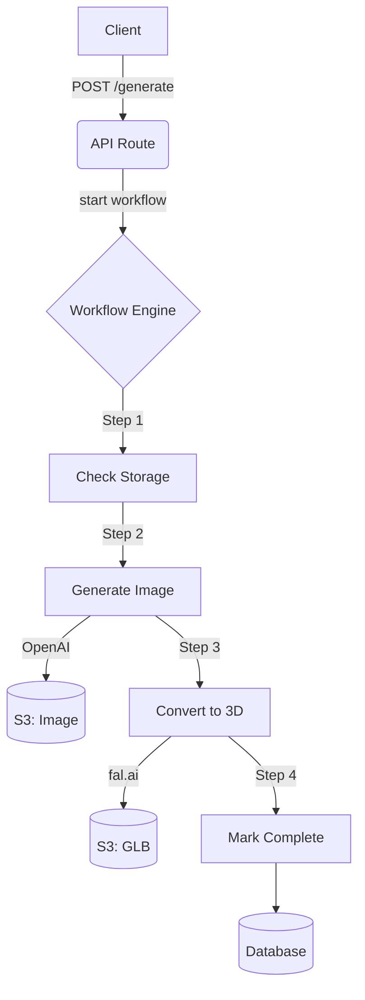

# 🌊 Vercel Workflow Architecture & Implementation

**Status:** ✅ Production Ready (Core Pipeline) | 🚧 Admin Integration (Planned)
**Last Updated:** 2025-11-18 (Consolidated)

**Source Documents & Status:**
- `docs/WORKFLOW.md` (Last Updated: 2025-11-05) - *Base document*
- `docs/IMAGE_PIPELINE_ANALYSIS.md` (Last Updated: 2025-11-05) - *Consolidated into this document*
- `docs/QUEUE_SOLUTION_ANALYSIS.md` (Historical Analysis) - *Superseded (Proposed Inngest, but defined the core problems solved by Vercel Workflow)*

---

## 📋 Executive Summary

MonstersInk uses **Vercel Workflow** to orchestrate the durable, resilient generation of 3D monster assets. This architecture replaces the previous polling-based system to solve timeout issues, ensure atomic execution, and provide built-in retries for expensive AI operations.

### Key Features
- **Durable Execution:** Workflows survive Vercel Serverless function timeouts (10s-60s) by suspending and resuming via event sourcing.
- **Zero Infrastructure:** Runs entirely on Vercel's platform without external queues (Redis/SQS).
- **Auto-Retry:** Built-in exponential backoff for transient errors (Rate limits, Network issues).
- **Idempotency:** Prevents duplicate AI costs via step-level caching and S3 metadata checks.
- **Observability:** Full inspection of run history, step status, and inputs/outputs.

---

## 📜 Historical Context: The Problem

*Analysis derived from `QUEUE_SOLUTION_ANALYSIS.md`*

The move to Vercel Workflow was necessitated by critical limitations in the previous polling-based architecture:

1.  **Vercel Function Timeouts:** Background `JobProcessor` logic would often be killed by Vercel's 10-60s execution limit during long OpenAI/fal.ai calls, leaving jobs in a "stuck" state and wasting API credits.
2.  **Navigation Issues:** If a user left the page, the client-side polling stopped, and the generation job often failed to complete or update the database.
3.  **Duplication & Costs:** Users refreshing the page could trigger duplicate jobs ($0.70+ wasted per run) due to race conditions in the "pending" check.
4.  **No Retry Guarantees:** Transient network errors caused immediate failure with no mechanism for automatic recovery.

**Vercel Workflow** solves all these issues by decoupling execution from the client and HTTP response cycle.

---

## 🏗️ System Architecture

### Core Workflow: `generateMonster`

The workflow coordinates the following pipeline:



### Three-Tier System Design

The codebase maintains three parallel implementations to support different environments:

1.  **Testing Pipeline** (`/src/services/ai-pipeline/`)
    - Uses local temp file storage.
    - For development and testing.
    - Direct file I/O operations.

2.  **Production Services** (`/src/services/production-*`)
    - S3/MinIO cloud storage.
    - Vercel serverless compatible.
    - Presigned URLs for secure access.
    - Cost tracking integrated.

3.  **Workflow Orchestration** (`/src/workflows/`) **(Active)**
    - Vercel Workflow v4.0.1-beta.9.
    - Durable execution with event sourcing.
    - Automatic retries with FatalError/RetryableError.
    - Idempotent S3 uploads using step metadata.

### File Structure

```
src/workflows/
├── generate-monster.ts        # Main orchestrator ("use workflow")
├── steps/
│   ├── check-storage.ts       # Pre-flight S3 check
│   ├── generate-image.ts      # OpenAI integration
│   ├── convert-3d.ts          # fal.ai integration
│   └── mark-complete.ts       # Database finalization
└── utils/
    ├── error-mapping.ts       # Error type mapping
    └── logging.ts             # Structured logging
```

---

## 🔄 Comprehensive Pipeline Flow

*Detailed user journey from `IMAGE_PIPELINE_ANALYSIS.md`*

```
┌─────────────────────────────────────────────────────────────────┐
│                    1. USER INITIATES GENERATION                  │
└─────────────────────────────────────────────────────────────────┘
                                  │
                  POST /api/generate-monster
                  (src/app/api/generate-monster/route.ts)
                                  │
           ┌──────────────────────┴──────────────────────┐
           │  • Validates user auth (Better Auth)        │
           │  • Checks rate limits (max active jobs)     │
           │  • Generates AI prompt server-side          │
           │  • Creates job in PostgreSQL (pending)      │
           └──────────────────────┬──────────────────────┘
                                  │
                        Returns jobId to client
                                  │
┌─────────────────────────────────────────────────────────────────┐
│                 2. WORKFLOW STARTED IMMEDIATELY                  │
└─────────────────────────────────────────────────────────────────┘
                                  │
              start(generateMonster, [{ jobId, userId, ... }])
                    (src/workflows/generate-monster.ts)
                                  │
           ┌──────────────────────┴──────────────────────┐
           │  VERCEL WORKFLOW ORCHESTRATION:             │
           │  • Durable execution (survives timeouts)    │
           │  • Event sourcing (replay on resume)        │
           │  • Automatic retries on failure             │
           │  • Store workflowRunId in database          │
           │  • Return runId to client for tracking      │
           └──────────────────────┬──────────────────────┘
                                  │
┌─────────────────────────────────────────────────────────────────┐
│      3. CLIENT POLLS FOR STATUS (doesn't trigger processing)    │
└─────────────────────────────────────────────────────────────────┘
                                  │
          GET /api/monster-status/[jobId] (every 2-5 seconds)
       (src/app/api/monster-status/[jobId]/route.ts)
                                  │
           ┌──────────────────────┴──────────────────────┐
           │  STATUS CHECK ONLY:                         │
           │  • Query workflow status via getRun()       │
           │  • Refresh presigned URLs if expired        │
           │  • Return current job state + progress      │
           │  • NO processing triggered here anymore     │
           └──────────────────────┬──────────────────────┘
```

---

## 💾 Data Model

### Database Integration (`monster_generations` table)

The system tracks workflow state alongside business logic using the `workflow_run_id` column.

| Column | Type | Purpose |
|--------|------|---------|
| `id` | UUID | Internal Job ID (Business Key) |
| `workflow_run_id` | String | Vercel Workflow Run ID (Infrastructure Key) |
| `status` | Enum | Granular user-facing status (`generating_image`, `converting_3d`, etc.) |
| `retry_count` | Int | Tracks retries for UI feedback |
| `openaiTextTokens` | Int | Prompt tokens consumed |
| `openaiImageTokens` | Int | Image output tokens |
| `totalCost` | Float | Final billable amount |

### Unique Constraints

To prevent duplicate billing on browser refresh:
- **Database:** Unique index on `user_id` where status is active.
- **API:** Pre-flight check for active jobs in `POST /generate-monster`.
- **Client:** `localStorage` check before submission.

---

## 🔍 Key Components Deep Dive

### 1. Prompt Engineering
*Server-side generation to prevent injection.*
- **Template System:** Randomized creature features (bodies, limbs, textures, eyes, colors).
- **Security:** User sends structured data, Server assembles full prompt with safety instructions.

### 2. Job State Machine (`src/lib/generation-job.ts`)
**13 Possible States:**
- `pending`: Created, waiting.
- `generating_image`: OpenAI API call in progress.
- `image_generation_failed` / `_retrying`: Failure handling.
- `converting_3d`: fal.ai API call in progress.
- `conversion_failed` / `_retrying`: Failure handling.
- `completed`: Success.
- `failed_permanent`: Exhausted retries.
- `waiting_on_storage`: S3/MinIO unreachable (paused).

### 3. Storage System (`src/services/s3-service.ts`)
- **S3/MinIO Compatible:** Uses presigned URLs for secure, direct client access.
- **Pre-flight Checks:** Step 1 of workflow checks accessibility to prevent wasted API calls.
- **Idempotency:** Uploads check for existing keys using metadata to skip duplicates during retries.

---

## 🔄 Error Handling & Retry Logic

Errors are classified into two types for the workflow engine, with progressive user messaging.

| Error Type | Behavior | Max Retries | Delay | Example Message |
|------------|----------|-------------|-------|-----------------|
| **RetryableError** | Auto-retry | Varies | Varies | "Connection hiccup! Retrying..." |
| **FatalError** | Stop | 0 | - | "Contact admin to refresh API key" |

### Retry Strategy Specifics

| Error Code | Max Retries | Delay |
|------------|-------------|-------|
| `openai_rate_limit` | 5 | 30s |
| `openai_network_timeout` | 3 | 15s |
| `fal_overloaded` | 10 | 120s |
| `fal_network_timeout` | 5 | 60s |
| `s3_upload_error` | 5 | 10s |

The database status is updated to `*_retrying` during these wait periods to inform the user.

---

## 💰 Cost Tracking

Costs are tracked per job for monitoring and billing.

| Service | Operation | Approx Cost | Tracking Method |
|---------|-----------|-------------|-----------------|
| **OpenAI** | dall-e-3 (1024x1024) | $0.04 | Token-based |
| **fal.ai** | tripo3d v2.5 image-to-3D | $0.30 | Fixed per conversion |
| **Vercel** | Workflow Execution | $0.00 | Included in Pro |
| **Total** | **Full Pipeline** | **~$0.34** | Aggregated in job record |

---

## 🔒 Security Features

- **Authentication:** Better Auth integration, GitHub OAuth required for advanced stages.
- **Rate Limiting:** `MAX_ACTIVE_JOBS_PER_USER = 3`.
- **Content Moderation:** All OpenAI outputs pass moderation checks.
- **Path Safety:** Filename sanitization to prevent path traversal.

---

## 🛠️ API Reference

### Start Generation
`POST /api/generate-monster`
- Checks for existing active jobs.
- Creates DB record.
- Calls `workflow.start()`.
- Returns `jobId` and `runId`.

### Check Status
`GET /api/monster-status/[jobId]`
- Fetches DB record.
- Calls `workflow.getRun(runId)` to sync status if needed.
- Returns merged status, progress, and presigned URLs.
- **Does NOT trigger processing logic.**

---

## 🔍 Operations & Monitoring

### CLI Inspection
Use the Vercel Workflow CLI to inspect production runs:

```bash
# List recent runs
npx workflow inspect runs --backend vercel

# View specific run details
npx workflow inspect run <run_id> --backend vercel

# Launch web dashboard
npx workflow inspect runs --backend vercel --web
```

### Setup Requirements
Environment variables required for production:
- `POSTGRES_URL`
- `OPENAI_API_KEY`
- `FAL_KEY`
- `S3_ACCESS_KEY` / `S3_SECRET_KEY` / `S3_BUCKET`
- `VERCEL_TOKEN` (for CLI inspection)

### Rollback Strategy
If the workflow system fails, rollback via feature flag:
1. Set `FEATURE_USE_WORKFLOW=false` in Vercel environment.
2. Redeploy.
3. System reverts to legacy polling-based `JobProcessor`.

---

## 🧪 Testing Guide

### Unit & Integration Tests
Run the standard test suite (mocks external APIs):
```bash
npm run test
```

### E2E Smoke Test (Costs ~$0.70)
To verify the full pipeline with real API calls:

1. Set `TEST_USE_REAL_APIS=true` in `.env.test`.
2. Run the smoke test:
   ```bash
   npm run test:smoke
   ```
3. Verify output:
   - Workflow starts and completes.
   - Files appear in S3.
   - Database status is `completed`.

---

## 🔮 Roadmap: Admin Integration

**Status:** Phase 1 Implementation Ready

The next phase involves exposing workflow internals to the Admin Dashboard for better support capabilities.

### Planned Features
1. **Workflow Status Panel:** Show `runId`, current step, and timing in Job Detail view.
2. **Timeline View:** Visual history of steps (Started -> Completed).
3. **Event Log:** Raw log of workflow events (Retries, Errors).
4. **Inspector Link:** Direct deep-link to Vercel Inspector for the specific run.